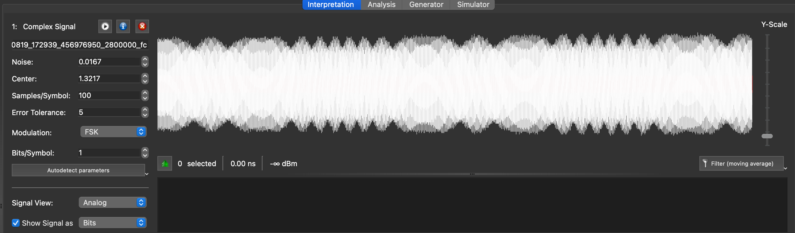
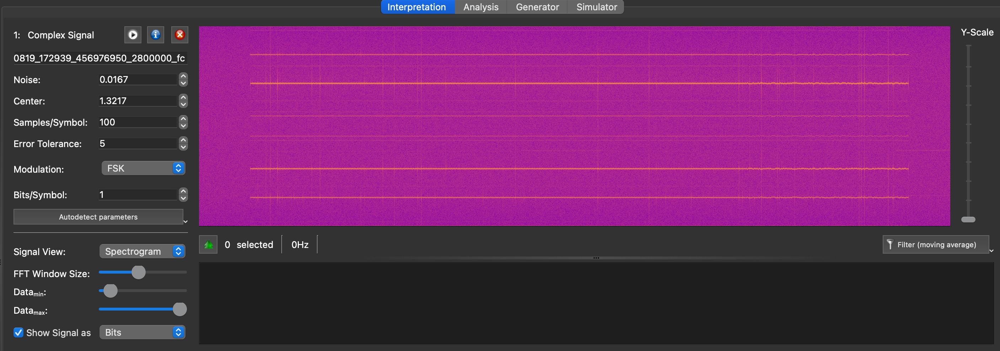
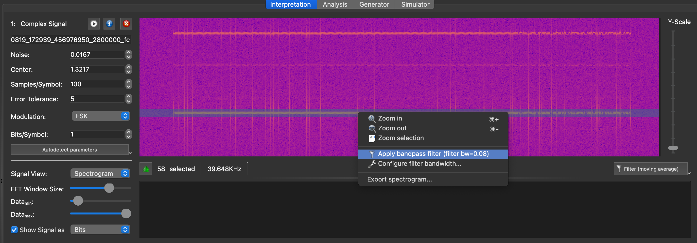
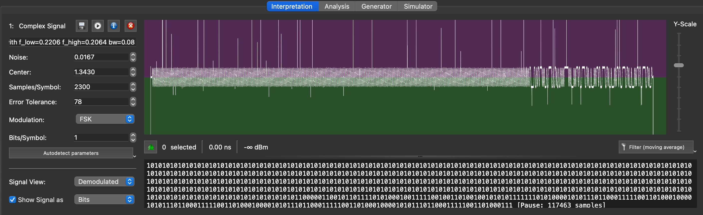
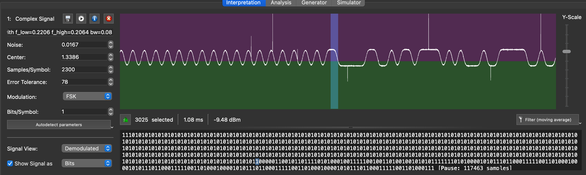
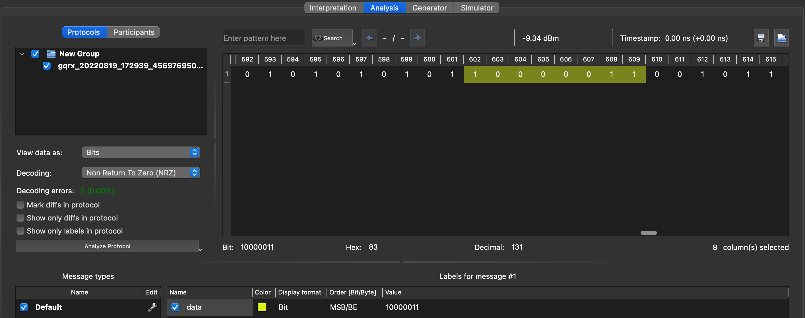
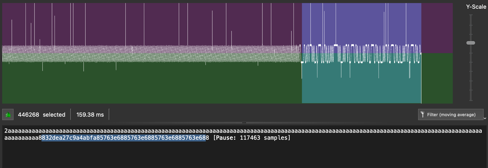

# Unknown FSK signal

## Example 1 - 2-FSK Restaurant pager

You can open this file in URH, and use the (i) dialog to set the sample rate (good practice so that the timings are displayed accurately).

Zooming in on the signal shows that we are dealing with multiple frequencies, which is a hint of a couple of things:

- It might be FSK
- The recording might contain both a signal and harmonics - possibly caused by a SDR frontend overload



We can qualify this by picking the spectrogram view and zoom in:



Zooming in further, it's clear that the horizontal lines are just the same signal appearing multiple times (and mirrored), which is typical of the SDR receiver being overloaded, so let's just select the strongest signal and isolate it:



The spectrogram view also shows clearly the presence of two different frequencies in the signal, so we're looking at a 2-tone FSK.

Once the signal is isolated, we can try to do an autodetect in FSK mode - since the signal is now filtered and its sampling rate is high, autodetect works well this time around:



Like with other sampled signals, it's obvious we have a long preamble to help the receiver synchronize, then a series of 0's and 1's. The demodulated view is fairly clean and by now it's clear we have a typical FSK signal with two tones. We can also look at the average length of a bit, and we find something around 800µs to 900µs, which would be consistent with a 1200bps rate which is classic.

In order to recover the value of the message, we need to zoom in on the end of the preample and determine the first bit of the payload. For this particular protocol, there is no pause between the end of the preamble and the bitstream, so the message most probably starts at the first bit that breaks the `01010101` sequence:



Moving to the "Analysis" screen, we can align the decoder by selecting the first 8 bits after the preamble and labeling those. This will force URH to align its decoding when translating to hexadecimal:



Switching back to hex format, we can see that the first byte is `0x83` - and that the sequence of `0xaa` was not perfectly aligned on multiples of 8 bits, so it was useful to create this label. If we switch back to the "Interpretation" screen _and_ click on the demodulated graph again, this will trigger a re-demodulation of the bitstream and the correct bitstream value will be updated in the hex dump:



The message seems to be this:

```
832dea27
c9a4abfa
85763e68
85763e68
85763e68
85763e68
```

Now, we need to make sense of it. In wireless protocols, besides preambles that are used to wake up receivers and help them sync their clocks, another pattern is often used to synchronize receivers: sync words/patterns. This is a special pattern that normally doesn't happen in the payload of wireless messages, and that receivers detect in order to align the decoding of the bitstream. Since the message contains a multiple of 4-byte sequences, there is a good chance the sync pattern is 0x832dea27.

At this point, unless you already have your own database of known sync words, a duckduckgo search is a good way to make progresss. `0x832dea27 sync pattern` is a good search, but... it does not return anything.

Going back to the "Analysis" screen, we can try to change the "Decoding" dropdown to `NRZ + Invert`. After all, there's no strict convention on what frequency should be a "1" and which should be a "0", so we invert the convention and see if that leads us somewhere. The - presumed - sync pattern is now demodulated as `0x7cd215d8`. And a `0x7cd215d8 sync pattern` immediately tells us that this is the pattern for... the [POCSAG](https://en.wikipedia.org/wiki/Radio-paging_code_No._1) pager protocol! This makes complete sense since this capture was from a restaurant pager.

We can therefore update the decoded stream with the inverted values (this time we must copy from the "Analysis" screen, since the "Interpretation" screen does not reflect decoding options and defaults to NRZ only). And we can actually decode the meaning using details on the protocol

```
7cd215d8  - Sync word
365b5405  - Message
7a89c197  - Idle frame
7a89c197  - Idle frame
7a89c197  - Idle frame
7a89c197  - Idle frame
```

Decoding POCSAG is a job of its own, but fortunately, tools like `multimod-ng` can do this very well: you now have all you need to transform the raw IQ file into a WAV file demodulated into narrow FM mode which will give you an audio FSK file with the two tones, you use gqrx to do this. Then play the resulting wav file into multimon-ng:

```
 ./multimon-ng -t wav -a POCSAG1200 ../../gqrx_20220821_193850_315598200.wav
multimon-ng 1.2.0
  (C) 1996/1997 by Tom Sailer HB9JNX/AE4WA
  (C) 2012-2022 by Elias Oenal
Available demodulators: POCSAG512 POCSAG1200 POCSAG2400 FLEX FLEX_NEXT EAS UFSK1200 CLIPFSK FMSFSK AFSK1200 AFSK2400 AFSK2400_2 AFSK2400_3 HAPN4800 FSK9600 DTMF ZVEI1 ZVEI2 ZVEI3 DZVEI PZVEI EEA EIA CCIR MORSE_CW DUMPCSV X10 SCOPE
Enabled demodulators: POCSAG1200
POCSAG1200: Address:  890576  Function: 2
POCSAG1200: Address:  890576  Function: 2
POCSAG1200: Address:  890576  Function: 2
POCSAG1200: Address:  890576  Function: 2
POCSAG1200: Address:  890576  Function: 2
POCSAG1200: Address:  890576  Function: 2
POCSAG1200: Address:  890576  Function: 2
POCSAG1200: Address:  899706  Function: 2
POCSAG1200: Address:  890576  Function: 2
POCSAG1200: Address:  890576  Function: 2
POCSAG1200: Address:  890576  Function: 2
POCSAG1200: Address:  890576  Function: 2
POCSAG1200: Address:  890576  Function: 2
POCSAG1200: Address:  890576  Function: 2
POCSAG1200: Address:  890576  Function: 2
POCSAG1200: Address:  890576  Function: 2
POCSAG1200: Address:  890576  Function: 2
POCSAG1200: Address:  890576  Function: 2
POCSAG1200: Address:  890576  Function: 2
sox WARN rate: rate clipped 5815 samples; decrease volume?
sox WARN dither: dither clipped 5090 samples; decrease volume?
POCSAG1200: Address:  890576  Function: 2
POCSAG1200: Address:  890576  Function: 2
POCSAG1200: Address: 1618195  Function: 2
POCSAG1200: Address:  890576  Function: 2
```

