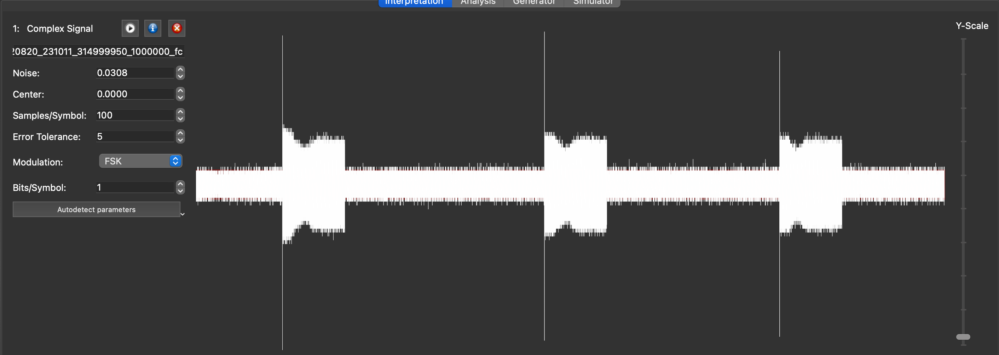
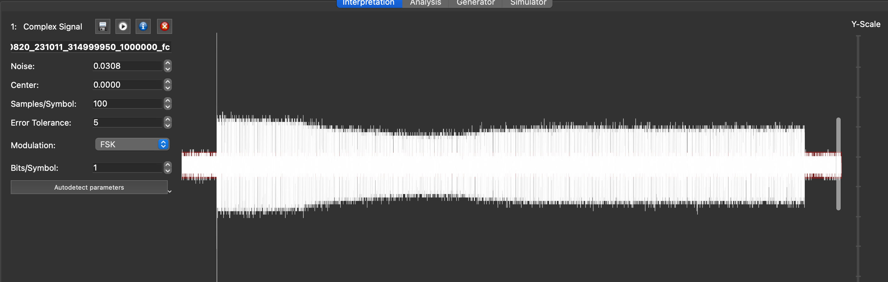
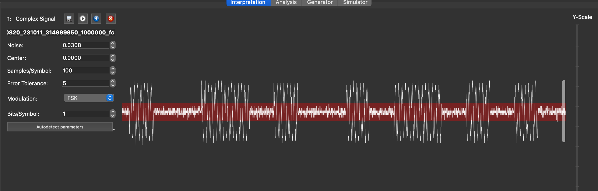
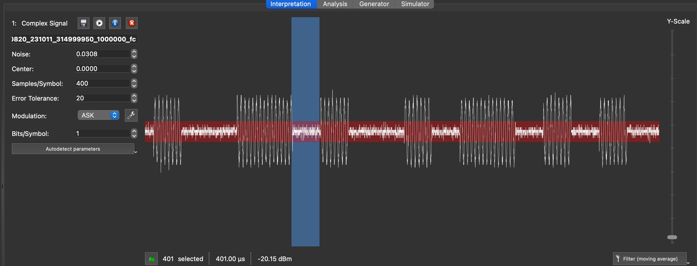
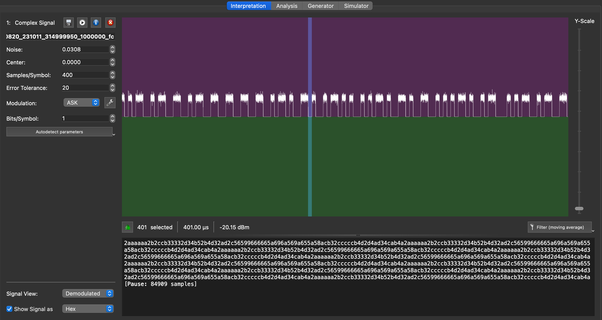
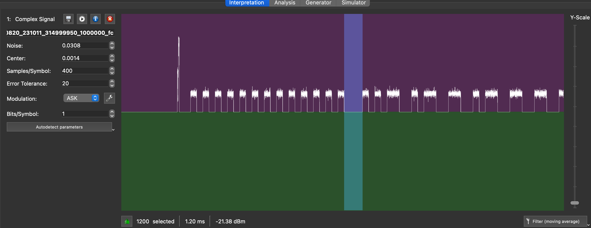
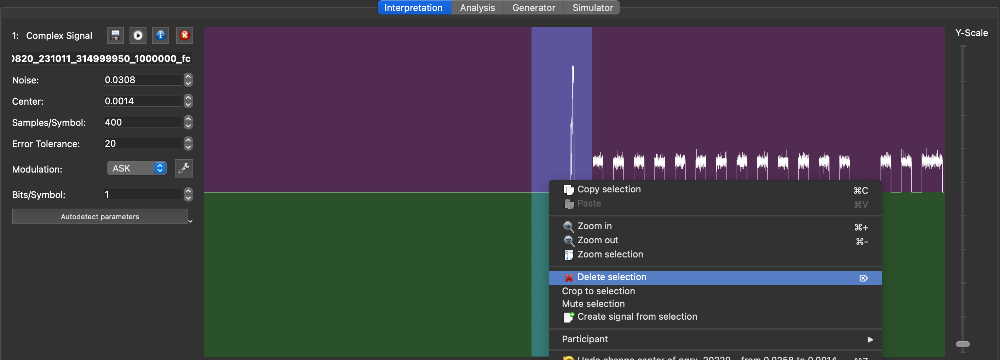

# Unknown OOK signal

## Example 1

The `samples/` directory contains an IQ file called `OOK-gqrx_20220820_231011_314999950_1000000_fc.raw` that was captured with GQRX using a RTL-SDR generic dongle. It is a bit noisy but representative of a real world capture.

GQRX names the files with the frequency of the receiver and the sample rate:

- 314999950 Hz: ~315 MHz
- 1000000 bps : 1Mbit/s sampling

### Using URH

You can open the larger file with URH and it will show you the waveform:



This is typical of a basic capture where the RTL-SDR dongle gain control will overcorrect the signal which creates the irregularities. It is clear that we have three separate frames, so let's focus on the first one: select the first frame and right-click to crop the signal:



Now, zooming in on the signal, you can clearly see an alternance of short bursts of varying length. This is typical of "OOK", or "On-Off Keying", where a transmitter sends a bitstream by either sending or not sending a signal at a specific frequency. "OOK" is also considered as the most simple type of "ASK" as "Amplitude Shift Keying", where a bitstreams 0's and 1's are either 0% signal or 100% signal.



This example is intentionally very simple: there are only 2 lenghts of short and long modulations or spaces, with the long one being double of the short one. This is a very simple modulation, where a "symbol" will be one bit, and the symbol length is the "short" length. We can just select it to find out.

**Hint: press the (i) in the left space where you adjust the variables, and set the sampling rate to "1M" to reflect the correct timing if you want to work out the bitrate of your signal**

You can now make progress on the demodulation and set sensible parameters in the toolbar on the left based on what you have learned so far:

- Adjust the value of "noise" to have the noise on the signal be just covered by the red area
- Adjust the "samples per symbol" to 400 since this is the length of the short interval we just worked out
- Set error tolerance to 5% - 20 samples. No need to be too strict on short timing errors, a lot of low cost transmitters are not super accurate anyway
- Set modulation to ASK



We will now focus on the lower half of the screen.

If demodulation worked ou as we expected, then if we select the "Signal View" dropdown to "demodulated", then it will be clear that we now have a stream of "0" and "1". We can also change the display of the bitstream to "hex", and as you can see on the screenshot, we can see repeating patterns which is always an encouraging sign:



Now, the question is whether we have actually properly decoded the message: while we clearly have a bitstream - 99.9% of the time aligned on bytes, i.e. 8 bits - , how do we know we have started the decoding of the bitstream at the first bit of the first byte>

The answer to this, in the vast majority of the cases, lies in the very start of the message: radio receivers also need to know the alignement, and most radio protocols include a 'preamble' to that effect. A classic preamble can be a series of 0's and 1's. Let's zoom in on the signal:



The preamble is clearly visible here, and you can also notice that the space between the end of the preamble and the start of the message is 1200µs - 400µs * 3. This is also a classic pattern on radio protocols to help the receiver not only detect the start of the message, but also calibrate the bitrate on the series of 0's and 1's. This allows the use of cheap transmitters and receivers with imprecise clocks with high tolerance, where they use the preamble to align their clock rates to each other - and is also why we set the tolerance to 5% above, to account for this.

The 0b10101010 pattern translates to 0xaa in hexadecimal, which is what we see in the hex dump in the URH window as well (see screenshot above). But the hex dump starts with "2", which is a glitch caused by the initial spike. We can therefore delete the unwanted glitch in the signal to start the decoding at the beginning of the preamble - or at the first bit after the preamble:



And here we have it: the decoded bitstream now starts with 0xaa and we can see the repeated patterns:

```
aaaaaa8acb32cccccb4d2d4ad34cab4b1596659999969a5a95a69956962b2ccb33332d34b52b4d32ad28
aaaaaa8acb32cccccb4d2d4ad34cab4b1596659999969a5a95a69956962b2ccb33332d34b52b4d32ad28
aaaaaa8acb32cccccb4d2d4ad34cab4b1596659999969a5a95a69956962b2ccb33332d34b52b4d32ad28
aaaaaa8acb32cccccb4d2d4ad34cab4b1596659999969a5a95a69956962b2ccb33332d34b52b4d32ad28
aaaaaa8acb32cccccb4d2d4ad34cab4b1596659999969a5a95a69956962b2ccb33332d34b52b4d32ad28
aaaaaa8acb32cccccb4d2d4ad34cab4b1596659999969a5a95a69956962b2ccb33332d34b52b4d32ad28
aaaaaa8acb32cccccb4d2d4ad34cab4b1596659999969a5a95a69956962b2ccb33332d34b52b4d32ad28
aaaaaa8acb32cccccb4d2d4ad34cab4b1596659999969a5a95a69956962b2ccb33332d34b52b4d32ad28
aaaaaa8acb32cccccb4d2d4ad34cab4b1596659999969a5a95a69956962b2ccb33332d34b52b4d32ad28
aaaaaa8acb32cccccb4d2d4ad34cab4b1596659999969a5a95a69956962b2ccb33332d34b52b4d32ad28
 [Pause: 84909 samples]
```

I will leave that this means as an exercise to the reader - don't waste too much time on it though, this is just a basic remote control message with a long bit pattern that has no special meaning besides "open".