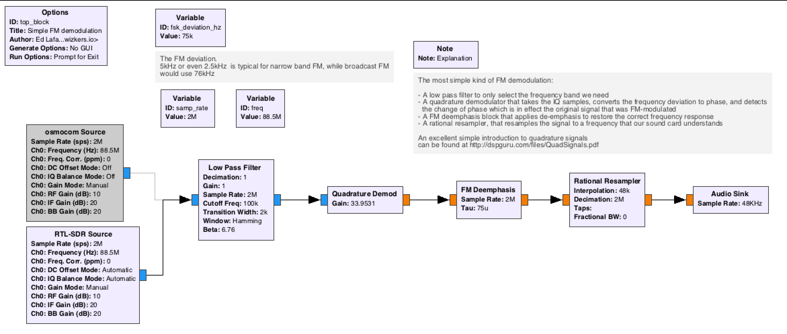
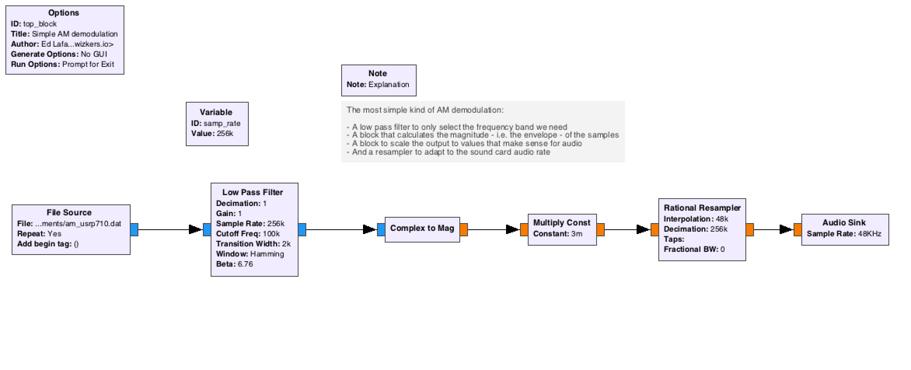
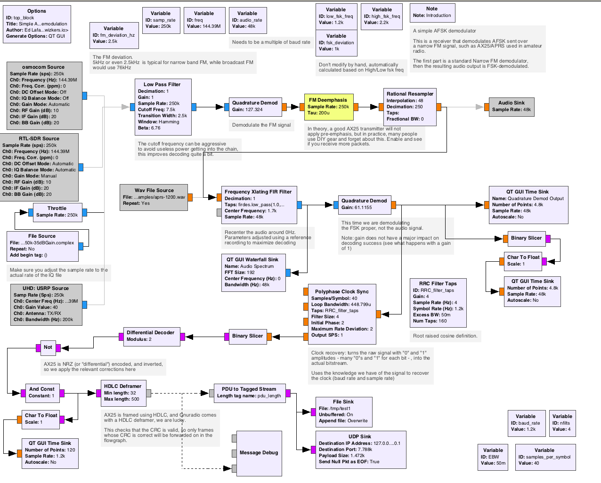
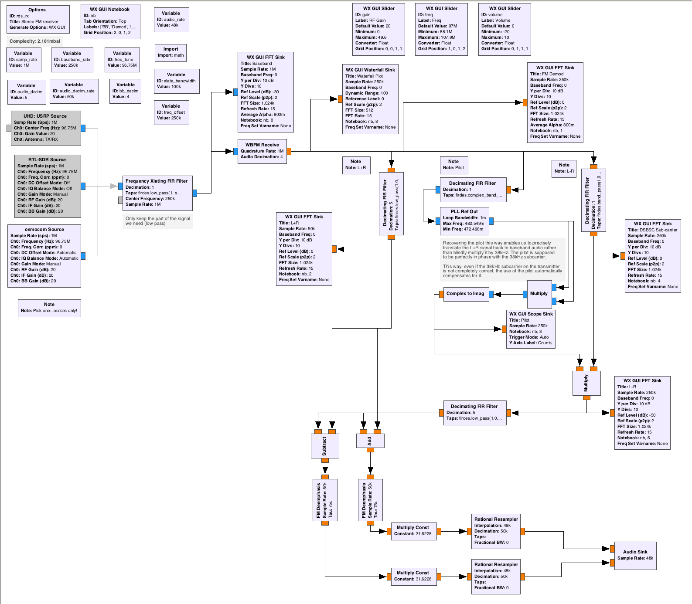

# Gnuradio, yet another guide

## Preamble

THESE ARE MY OWN NOTES AFTER WORKING WITH GNURADIO FOR A WHILE, NO PROMISE OF ANY FITNESS FOR ANY PARTICULAR PURPOSE.

A lot of those flowgraphs are my own, some are adapted/copied from various sources online. If you recognize your work and think it is missing attribution, please reach out and I will add proper credit where it's due. I simply haven't tracked down all my sources as I went along...

## Introduction

GNURadio is an amazing framework for all things related radio digital signal processing, and it is as powerful as it is daunting: it is a fairly venerable project started in 2001, and has always been a real adventure to install on any computer. The main gnuradio documentation, maintained on wiki.gnuradio.org, will usually help, but it is all in all fairly sparse and often quite arcane.

There is a lot of material out there about GNURadio, with varying degrees of relevance, accuracy, compatibility with the current versions of GNURadio. This guide is an attempt at covering most of the basics of building GNURadio flowgraphs to process most common radio modulations, along with examples of more advanced software, often based on GNURadio, designed to fully demodulate various categories of radio signals.

A common challenge for many newcomers is that GNURadio is before anything else a digital signal processing framework: despite the 'Lego'-like approach of building flowgraphs on GNURadio Companion, you will always be very limited in what you can achieve without proper understanding of the fundamentals of digital signal processing. There are a lot of excellent resources on the web for learning this (see the links section below), as well as many university courses, and if you are seriously planning to use GNURadio for real projects, learning - or taking a refresher on - digital signal processing is really a must.

This guide is an attempt at getting you up and running on GNURadio as of early 2019, and introduce you to the basic building blocks of the framework, so that you can in turn use GNURadio for your own projects.

Last, this guide is heavily biased towards MacOS, and everything in here is working with GNURadio version 3.7.14. YMMV.

## Links

A lot of the material in the following links is useful for learning not only about GNURadio, but also about digital signal processing.

- [Introduction to quadrature signals by dspguru](http://dspguru.com/files/QuadSignals.pdf). An excellent and approachable paper.
- [balint256 YouTube channel](https://www.youtube.com/user/balint256). The GNURadio video tutorial there is outdated, but contains a lot of great fundamentals, definitely worth a watch.
- http://complextoreal.com/tutorials/

## Variants of GNURadio - main/next/etc

GNURadio uses a concept of "gnuradio" and "gnuradio-next" for its stable and development branches. The stable branch is usually the way to go.

## Installing GNURadio

https://wiki.gnuradio.org/index.php/InstallingGR is the official documentation. Below are my own notes on how to actually get it to work

### Linux

Most distributions do have a gnuradio package. Be careful though, those versions are often out of date, especially the 'stable' versions.

My advice is to first check out the version of GNURadio that is available on your package manager, then decide whether you want to go to the trouble of going a source code install, which is not a super trivial task. That said, GNURadio has improved that respect a lot over the years by using their own Python system they call "PyBOMBS".

If you want to attempt a source install, follow the guide at: https://wiki.gnuradio.org/index.php/InstallingGRFromSource

#### Running in a Linux VM

While running GNURadio inside a Linux VM works fine, you will probably encounter performance issues when using it with physical SDR radios over USB, so a native version is usually preferable.

### MacOS

MacOS does run GNURadio quite well, and has its own install page on the GNURadio wiki: https://wiki.gnuradio.org/index.php/MacInstall

As with Linux, using a package manager is a good idea if the package is not too outdated. Macports is usually considered as the most stable and maintained port for GNURadio, but Homebrew has been making great progress lately, and will get you up and running quite well.

As of 2019.04, my advice is to go the Macports way to install the stable version of GNURadio, it does work well and closely follows the GNURadio project releases.

#### MacOS quirks

As usual with Open Source projects, there are a bunch of weird quirks for running various parts of GNURadio, in particular when using Gnuradio Companion with Qt blocks: the symptom is the UI flickering very fast. This can be easily solved though, by configuring the global settings at `~/.gnuradio/config.conf` with:

```sh
[qtgui]
style = native
```

If you installed GNURadio through MacPorts, you might have to explicitly tell cmake to point to `/opt/local` when compiling OOT ("Out of tree") modules:

```sh
cmake -DCMAKE_INSTALL_PREFIX=/opt/local ..
```

#### Using PyBOMBS

Apparently, some say this is possible on MacOS X... I have not attempted this.

### Optimization tricks

ToDo: speak about hardware acceleration, expectations of performance, etc.

## GNURadio companion

GNURadio companion is the graphical flow graph editor of GNURadio, and a great way to do rapid prototyping on this framework. While you will probably want to work in either C++ or Python for production usage if you intend to use the GNURadio framework for your own applications, GNURadio companion is a perfect tool for doing lab work and general signal hacking.

GNURadio companion uses a graphical editor to layout GNURadio blocks and connect them together.

### GNURadio blocks

GNURadio uses a concept of signal processing blocks. Those blocks can be written in a variety of languages, from Python to C++, with C++ implementations being usually faster than Python. There is documentation on the GNURadio wiki about writing modules, that might or might not be matching the current version of GNURadio, but will in any case provide a bit of help.

ToDo: describe the blocks, what they do, etc.

## Other useful utilities

Those are utilities I have found really useful in working with new signals:

### gqrx

[gqrx](https://gqrx.dk) is an easy(ish) to use software defined radio receiver, that is a great tool for quickly visualizing a signal.

ToDo: examples of signals and how to recognize them

### URH

[Universal Radio Hacker](https://github.com/jopohl/urh) is a lower level tool that can be very powerful to understand digital modulations and quickly do demodulation work. It comes with excellent documentation for an Open Source project, which is a really refreshing change.

ToDo: examples of demodulating a signal with URH

#### MacOS notes

Macports does not have a URH port, but you can install all of its dependencies from macports. Then you can run it, but be sure to `export CFLAGS="-I /opt/local/include` before either doing a pip install or running from the source tree.

In order to compile SDR extensions on MacOS with Macports, use the fork at https://github.com/elafargue/urh which supports that distribution.

ToDo: URH tutorial

### Inspectrum

[Inspectrum](https://github.com/miek/inspectrum/) is similar to URH but written in C++. It is fairly simple to build and is a good addition to any signal processing toolbox.

## SDR setups

### rtl-sdr

### USRP

### osmocom / BladeRF

## Simple analog operations

### FM Demodulation

FM demodulation is fairly simple: a FM-modulated signal is a carrier whose frequency varies proportionnal to the signal that we want to transmit. See [wikipedia](https://en.wikipedia.org/wiki/Frequency_modulation) for the basics.

From a Gnuradio companion perspective, it is very simple to represent in a flowgraph:



Flowgraph file is [here](https://github.com/elafargue/gr-experiments/blob/master/basic-fm-receiver.grc).

This is a good first example, because it covers the very basics of what digital signal processing of radio signals is about. A great introduction to this, in case you do not yet understand the principle of working with in-phase and quadrature (aka IQ) signal components, is the [introduction by dspguru](http://dspguru.com/files/QuadSignals.pdf).

### AM Demodulation

AM demodulation is similar: an AM-modulated signal is also a carrier, but this time the amplitude of this carrier varies along with the signal we want to transmit. We can simply demodulate this signal by detecting the envelope of the received signal:

The most basic GNURadio flowgraph for this would be as follows:



Flowgraph file is [here](https://github.com/elafargue/gr-experiments/blob/master/basic-am-receiver.grc).

*note:* this refers to the example data file available at the excellent course at: http://www.csun.edu/~skatz/katzpage/sdr_project/ . You should look up this site to learn more able AM and SSB in relation to digital radio.

### SSB Demodulation

Single side band is an energy-efficient variant of amplitude modulation. Essentially, it is AM modulation with the carrier suppressed, and only one of the sidebands transmitted. It is not difficult to modulate, but demodulating it is slightly more complex. There are a couple of DSP algorithms out there for doing this, but Weaver is by far the most popular because it is very well suited to software defined radio.

Reference links:

- [Very good overview of SSB demodulation techniques](http://www.panoradio-sdr.de/ssb-demodulation/)
- [Course on Weaver demodulation with clear explanation of the technique](http://www.csun.edu/~skatz/katzpage/sdr_project/sdr/ssb_rcv_signals.pdf)

(todo: insert flowgraph of my own SSB receiver)

Flowgraph file is [here](https://github.com/elafargue/gr-experiments/blob/master/basic-ssb-receiver.grc)

#### Analog and digital video

Quick side note on video: there is a great utility that works with "Tempest" radiated transmission on video signals (TODO: more background on Tempest): TempestSDR, which works great with the USRP.

[TempestSDR](https://github.com/martinmarinov/TempestSDR). Works great on the Mac. You will need to patch a couple of things to make it run, but nothing bad:

```
--- a/TSDRPlugin_UHD/src/TSDRPlugin_UHD.cpp
+++ b/TSDRPlugin_UHD/src/TSDRPlugin_UHD.cpp
@@ -14,7 +14,7 @@
 #include <stdlib.h>
 #include <string.h>
 
-#include <uhd/utils/thread_priority.hpp>
+#include <uhd/utils/thread.hpp>
 #include <uhd/utils/safe_main.hpp>
 #include <uhd/usrp/multi_usrp.hpp>
 #include <uhd/transport/udp_simple.hpp>
@@ -332,7 +332,7 @@ EXTERNC TSDRPLUGIN_API int __stdcall tsdrplugin_readasync(tsdrplugin_readasync_f
 		// flush usrpbuffer
 	    while(rx_stream->recv(
 	        buff, samples_per_api_read, md,
-	        uhd::device::RECV_MODE_ONE_PACKET
+	        true
 	    )){
 	        /* NOP */
 	    };
```


## Digital operations

Nowadays, radio signals are often used to transmit bits rather than analog information. This section covers some common techniques used for doing this.

### Basics of digital operations

Digital signals are usually modulated using a combination of the amplitude, frequency and phase of a signal. To make demodulation easier, binary data is often encapsulated into frames that usually contain:

- A start sequence, used by the demodulator to synchronise itself to the incoming bitstream
- Some sort of header that contains the expected length of the frame
- Error correcting codes, either throughout or at the end of the frame.

Digital to analogue conversion, besides modulating a bitstream using Amplitude/Frequency/Phase or a combination of all of these, also uses a notion of "symbols": instead of doing a one-to-one conversion of a "0" or "1" into two discrete analogue signal states, a lot of modulation schemes take longer bit sequences, such as "00" "01" "10" "11" and turn them into multiple discrete analogue signal states. Those sequences are called "symbols" and allow increasing the density of information that is sent inside of each modulation state.

A demodulator therefore needs to do the following on an incoming analog signal:

- Demodulate the raw analogue signal to turn it in to a "clean" analogue signal with clear discrete states
- Turn that demodulated analogue signal into a symbols by knowing exactly when to sample the signal state to map it to symbols. This is called "clock recovery"
- Remap the symbols to bit values
- Find start sequences in the bitstream to get in sync
- Recover packet length
- "Deframe" the packet and check its CRC

GNURadio provides a lot of blocks to do almost all of these operations, but start sequence detection and deframing is usually quite specific to each modulation type, and there is only a limited number of off the shelf blocks that can be used for this. You will often need to get into python - or C - and write your own blocks for those.

The next couple of sections provide more details on some of the aspects of demodulation using GNURadio.

From a more tactical perspective, what you will usually find in a flowgraph is the following:

1. Analogue signal reception from SDR
2. Low Pass / frequency translate to center the signal around zero hertz
3. Analogue demodulate
4. Clock Recovery
5. Bitstream decoding (NRZ, Manchester, inversion, etc)
6. Bitstream deframing

The analogue part was covered to some extent in some of the basic receivers above.

#### Clock recovery

Clock recovery is essentially a process that decides when the analogue signal should be sampled to determine the symbol state. When it works well, clock recovery will sample exactly once per transmitted symbol.

GNURadio provides several good clock recovery blocks in the "Synchronizers" category. Some of the blocks that are easier to use are:

- Clock Recovery MM
- Polyphase Clock Sync

With those blocks, you will need to know the symbol rate and bitrate in advance, so that they can make the right decision for sampling the symbols. The AFSK AX25 decoder flow graph below is a good example of using the Polyphase Clock Sync or the Clock Recovery MM blocks.

### Processing bitstreams

### OOK / ASK

This is one of the simplest kinds of digital modulation: a carrier that is simply turned on/off to transmit information, hence the "OOK" (On-Off keying) or "ASK" (Amplitude Shift Keying) acronyms.

#### Useful demodulators

[rtl_433](https://github.com/merbanan/rtl_433) is a great general purpose demodulator and decoder for OOK signals, and is able to decode more than a hundred types of simple sensors, from wireless alarm sensors to a bunch of weather sensors.

[rtlamr](https://github.com/bemasher/rtlamr) An rtl-sdr receiver for Itron ERT compatible smart meters operating in the 900MHz ISM band.

### Frequency shift keying

Frequency Shift Keying, or "FSK", uses discrete frequency changes of a carrier signal for modulating a bitstream. The simplest FSk uses two frequencies, one for "0" and one for "1", but it is also possible to use a larger number of discrete frequencies to encode longer symbols - for example "00", "01", "10" and "11" can be transmitted using 4-FSK, i.e. four separate frequencies.

FSK is usually demodulated using quadrature demodulation.

Note that a FSK-modulated signal can be transmitted as a carrier changing over N frequencies (usually within a couple of hundred hertz of each other), or through discrete frequency changes of a signal that is FM or AM modulated. In the latter case, we usually talk about "AFSK", or "Audio FSK".

Other kinds of FSK exist that were designed to improve specific aspects of this sort of modulation, such as power efficiciency. The [wikipedia](https://en.wikipedia.org/wiki/Frequency-shift_keying) article on FSK is a nice introduction and easy to understand.

#### Links

- https://github.com/handiko/gr-APRS
- A great tutorial: http://aaronscher.com/GNU_Radio_Companion_Collection/Audio_Modem_loop_back_test_FSK.html
- Another one: https://nccgroup.github.io/RFTM/fsk_receiver.html

#### 2-AFSK

The easiest way to demodulate a FSK transmission is to use a Quadrature demodulation block: the output of quadrature demodulation varies with the phase change that occurs at frequency transition between the FSK frequencies, so this is a good way to turn the signal into symbol states.

Since 2-FSK uses only 2 frequencies, there is usually a direct mapping of the frequency to either a "0" or "1" value, though you have to keep in mind that the signal is often encoded for robustness and energy efficiency using differential or Manchester encoding.

The sample [AX25](https://en.wikipedia.org/wiki/AX.25) receiver included in this repository is a great example of 2-AFSK reception. You can use this flowgraph and adapt it to other types of modulation fairly easily:

- Adjust the FSK deviation of the signal
- Adjust the birate
- Adjust the bitstream decoding after the binary slicer

Note: as you can see on the flowgraph below, we are doing _two_ demodulations. You have to keep in mind that FM modulation of an analogue signal modulates the carrier signal by an amount that is proportional to the original analogue signal, but multiplied by a "modulation index". For this reason, it is not possible to simply convert a FM-modulated signal into a FSK bitstream, you first need to demodulate the FM signal into the deviation-correct FSK analogue modulation, then demodulate that signal into a bitstream. Another equivalent way to look at is is that AX25 is transmitted over narrow-band HAM radio, so the flowgraph first demodulates the FM signal into an audio signal, then it does the actual Audio FSK (aka AFSK) demodulation.


[GRC Flowgraph code](https://github.com/elafargue/gr-experiments/blob/master/basic-ax25-receiver.grc)



#### 2-FSK

A good example of a 2-FSK signal is the old school "RTTY" modulation

### N-FSK

#### Links

- http://qradiolink.org/4fsk-viterbi-soft-symbol-decoding.html

### Phase shift keying

### OFDM

## Real world examples

### Broadcast FM

[Broadcast FM](https://en.wikipedia.org/wiki/FM_broadcasting) is kind of a "Hello World" of radio reception on GNURadio, the below flowgraphs are a good example of making your first steps with it. The main difference between "Broadcast FM" compared to just "FM" modulation is the following:

- Broadcast FM uses a standardized frequency deviation, usually with a maximum of 75kHz
- Pre-emphasis is applied to the signal to offset the effect of band noise
- Modern FM usually is broadcast in stereo (see below or Wikipedia for details)
- More and more, digital information is included in the broadcast (data, audio, or both)

#### Mono

A Broadcast mono FM receiver is really a standard FM receiver with standard deviation and de-emphasis applied.  It is identical to the flowgraph shown above on basic FM reception:


[Flowgraph](https://github.com/elafargue/gr-experiments/blob/master/basic-fm-receiver.grc)

#### Stereo

Stereo signals are transmitted at a set of two channels: the "R+L" channels at baseband audio frequency, and "R-L" centered on 38kHz higher. This makes them compatible with mono receivers that will just demodulate the R+L component.

A 19kHz pilot tone is also added to help receivers detect the presence of a stereo signal, and also reconstruct the 38kHz subcarrier to demodulate the R-L signal.

For this reason, a FM stereo receiver is a a bit more complex:



[Flowgraph]()


#### Stereo with RDS

[Basic receiver](https://github.com/elafargue/gr-experiments/blob/master/rds_rx_wx.grc).

[Basic transmitter](https://github.com/elafargue/gr-experiments/blob/master/fm-stereo-rds-tx.grc)

### HD Radio

This requires additional gnuradio modules like gr-ncrs5.

[Transmitter](https://github.com/elafargue/gr-experiments/blob/master/hdradio-tx.grc)

I do not have a flowgraph for a receiver.

### Narrow band FM (“Walkie Talkies”)

#### FRS transceiver

### Texas Instruments C1111

https://github.com/funoverip/gr-cc1111

### ADSB reception

ToDo: explain ADSB demodulation on both gnuradio (if that exists at all), and on native utilities

#### dump1090

The dump1090 is the best known utility to receive ADS-B frames from planes and helicopters. It was originally created as a quick hack and abandonned by its creator, then taken over by a couple of other people, before finding a home with Flight Aware who are maintaining the [most up to date version](https://github.com/flightaware/dump1090) these days (2019.04).

dump1090 works great on a Raspberry Pi, and the best way to install it is to clone the github repository, and build the debian package from there.

*BladeRF Micro support:* I have opened a [pull request](https://github.com/flightaware/dump1090/pull/37) to add support for the BladeRF micro. Note that the BladeRF micro does not seem to work nearly as well as the bespoke rtl-sdr based orange dongle of Flight Aware, I might need to spend more time working at the gain settings for that device. In theory it should be able to work as well as RTL-SDR dongles, especially if used with a LNA.

### GPS/GNSS

#### Receiving

There are several packages available out there to do GNSS demodulation. The most advanced is the creatively-named 'gnss-sdr' package available on  [github](https://github.com/gnss-sdr/gnss-sdr).

##### MacOS support notes for gnss-sdr

2019.04: gnss-sdr is avaible on MacPort but on an outdated version that basically crashes with any current SDR (rtlsdr/osmocom). it is possible to build on MacOS though, using the current version of GNURadio installed through Macports. There are good build instructions available on the main github README.md page for gnss-sdr which you should follow.

Don't forget to add "cmake -DENABLE_OSMOSDR=ON .." if you want OsmoSDR support (BladeRF, RTL-SDR etc).

CAREFUL: be sure you do not have a lingering version of gnss-sdr installed through a package manager when you are trying to build from source, since it will usually make compilation fail. In particular, volk will leave a "volk_gnss" include path on the package manager paths (`/opt/local/include` for macports) that will mess up compilation, you might have to delete by hand. Also, make sure that in case you have an old homebrew install on `/usr/local`, none of the libraries gnss-sdr relies on are found on that path (check out the output of the cmake step).

##### Testing

Once everything is installed (installing from a source compilation does to `/usr/local` by default), you can follow the tutorial on the [gnss-sdr website](https://gnss-sdr.org/my-first-fix/) and download the test file. It should decode without issues.

##### Frontends

The [Configurations](https://gnss-sdr.org/conf/) page on the gnss-sdr website does a good job explaining how to configure a couple of frontends.

As the main site mentions, be sure you use an active antenna - use a bias Tee if necessary - since the GPS signal is usually below the sensitivity level of most SDRs.

##### BladeRF Micro configuration

It appears that the BladeRF micro as it stands today cannot really receive GPS without external help: https://www.nuand.com/forums/viewtopic.php?t=4984 . Don't waste your time if you have other options.

##### RTLSDR configuration

#### Sending

*Careful:* do not blindly broadcast your own GPS signals, this is illegal, and will lead to very serious trouble if you get caught doing this.

##### gps-sdr-sim

Available on [github](https://github.com/osqzss/gps-sdr-sim), it seems to be the reference. The current version as of 2019 works very well, and will accept 10Hz NMEA input as well as a couple or other formats, and is easy to extend.

It is also compatible with multiple frontends and I have tested it with success on URSP SDRs.

A great way to test this is to feed the generated ".bin" file to gnss-sdr.

### Bluetooth

### WiFi

## Investigating unknown signals

### Using URH

### Writing a bitstream processor

